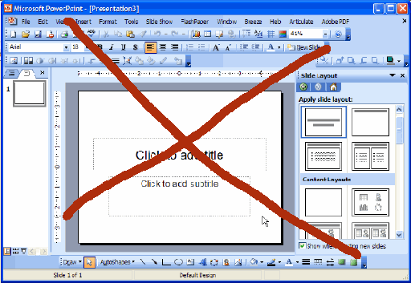

# Intro

## It is Not

A powerful **WYSIWG** slideshow editor

## Features

* Create a slideshow in **Markdown**
* Display it in web browser
* Themed by **CSS**
* Hosted on Github Pages  

## Advantages

* Markdown is **awesome**, so it is awesome, too. 
* As **compatible** as a web page.    
* The content and view are **separated**! 
* If you can **write**, then you can make slideshow.
* A new way to **share** slideshows, like web pages.  

# Usage

## 1. Clone the original files

    $ git clone https://github.com/onesuper/weakpoint TESTNAME
    $ cd TESTNAME
    $ git remote set-url origin \
	git@github.com: USERNAME/TESTNAME.git
    $ git push origin master

## 2. Config your slideshow in 'config.yaml'

	filename: weakpoint.md
	theme: clean
	googlefonts: Eater
	meta:
	  title: WeakPoint
	  subtitle: Weak is more powerful
	  author: onesuper
	  email: onesuperclark@gmail.com
    ...
	
[config.yaml of this slideshow](config.yaml)

## 3. Write your own Markdown file 

	# Chapter 1
	
	## It is a headline
	* first
	* second
	* third
	
	## Yet another headline
	It is a lovely day.
	
[markdown of this slideshow](weakpoint.md)

## 4. Build slides by typing 'python bootstrap.py'

    $ python bootstrap.py
 

## 5. Deploy them to Github Pages

    $ git checkout -- orphan gh-pages
    $ git add .
    $ git commit -m 'First page commit for my slides'
    $ git push origin gh-pages

# Misc

## $ \LaTeX $

*This is inline:* $ e^{ix} = \cos x + i\;\sin x $

And what's more:

$$
P_k= \frac{np(np-p)\dots(np-kp+p)}{k!}      \frac  {  {(1-p)^{-\frac{1}{p}} }^{-np}}   {(1-p)^{k}}
$$

# Others

## Libraries

1. [PyYAML](http://pyyaml.org/)
2. [Markdown in Python](http://freewisdom.org/projects/python-markdown/)
3. [bxslider](http://bxslider.com/)

## More Reading

* [用Markdown写幻灯片，用浏览器展示](http://blog.chengyichao.info/2012/06/17/slideshow-in-markdown/)
* [WeakPoint v1.0](http://blog.chengyichao.info/2012/07/07/weakpoint-v1)
