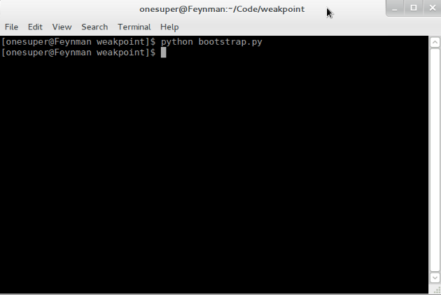

# Intro

-------------

## It is Not

A powerful **WYSIWG** slideshow editor

----------------------
## Features

* Create a slideshow in **Markdown**
* Display it in web browser
* Themed by **CSS**
* Hosted on Github Pages

-------------------------

## Advantages

* Markdown is **awesome**, so it is awesome, too.
* As **compatible** as a web page.
* The content and view are **sperated**! 
* If you can **write**, then you can make slideshow.
* A new way to **share** slideshows, like web pages.

--------------------------

# Use

-----------------------

## Config your slideshow in '_config.yaml'

	filename: weakpoint.md
	theme: clean
	google-font:
	   font1: Eater
	   font2:
	meta:
	  title: WeakPoint
	  subtitle: Weak is more powerful
	  author: onesuper
	  email: onesuperclark

----------------------

## Write your own Mardown file 

	## It is a headline
	* first
	* second
	* third
	----
	## Yet another headline
	It is a lovely day.
	
	
	Isn't it?
	----

The '----' splits two slides...

-----------------------

## Deploy it by typing 'python bootstrap.py'

Bootstrap your slideshow in command-line

---------------------

# Others

--------------------

## Libraries

1. [PyYAML](http://pyyaml.org/)
2. [Markdown in Python](http://freewisdom.org/projects/python-markdown/)

--------------------

## Going to Be?

* slideshow hosting and sharing?
* next Wordpress?

------------------------

# Thanks
